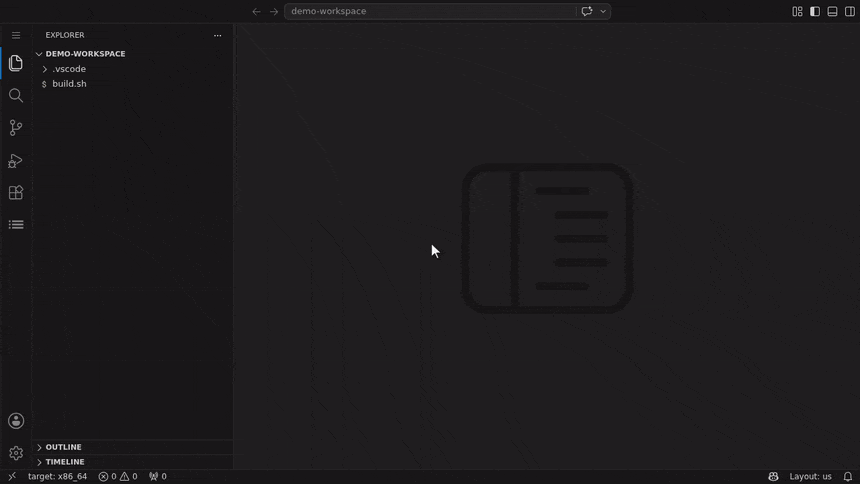
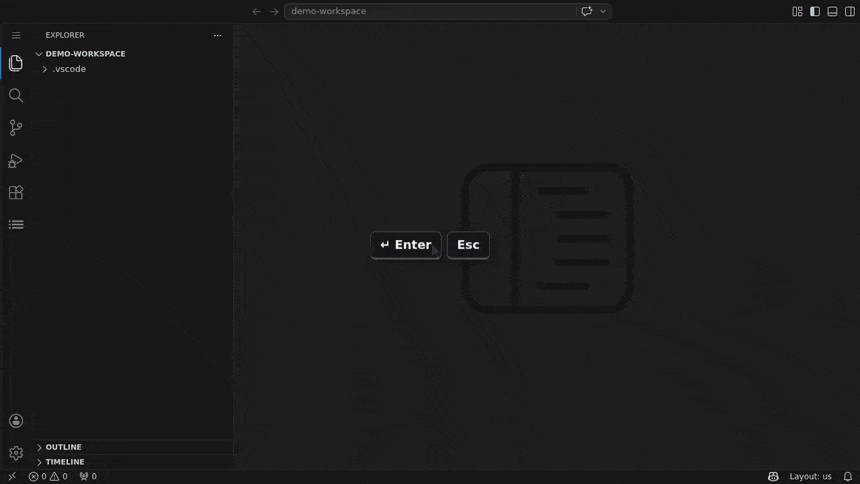

# Status Bar Parameter

Pick a value once in the status bar, then reuse that value in every task,
launch config, or `.code-workspace` entry that references the parameter.



Minimal `tasks.json` example:

```jsonc
{
    "version": "2.0.0",
    "tasks": [
        {
            "label": "build",
            "type": "process",
            "command": "./build.sh",
            "args": ["${input:target}"],
            "problemMatcher": []
        }
    ],
    "inputs": [
        {
            "id": "target",
            "type": "command",
            "command": "statusBarParam.get.target",
            "args": ["x86_64", "armv7", "aarch64"]
        }
    ]
}
```

Switch `target` to `aarch64` in the status bar, and the task runs as:

```sh
./build.sh aarch64
```

Nothing else changes: the build script, the launch config, and any other task
that references `${input:target}` all follow the one selection.

## Configuration

Add a parameter with `Status Bar Parameter: Add Parameter` or from the
**Status Bar Parameter** view in the activity bar. The wizard asks for the
target file, type, id, values or shell command, and optional advanced settings.
You can also insert a complete example and edit it in JSON.



Parameters can live in:

- `tasks.json`, including global user tasks
- `launch.json`
- `*.code-workspace`

Select a value by clicking its status-bar item or running
`Status Bar Parameter: Change Selection`. Selections persist across restarts,
and the extension works in remote windows.

To change or remove a parameter, edit or delete its entry in the `inputs`
section of the configuration file it lives in.

Use the selected value with VS Code variable substitution:

- `${input:<id>}` works only in the `tasks`/`launch` input scope that defines
  the parameter.
- `${command:statusBarParam.get.<id>}` works from any configuration file.

Parameter ids must use only letters, digits, `_`, `.`, or `-`, and must be
unique across all configuration files because they share one command namespace.

## Advanced Configuration

The extension reads VS Code `inputs` entries whose `type` is `"command"` and
whose `command` is `statusBarParam.get.<id>`, matching the input `id`.
Configure parameter behavior under `args`.

### Value Shapes

Array parameters can use these value shapes:

- **Plain values** return and display the same string.

  ```jsonc
  "args": ["x86_64", "armv7", "aarch64"]
  ```

- **Display labels** show a friendly label while returning the raw `value`.
  Plain values and display-labelled values can be mixed.

  ```jsonc
  "args": [
      "x86_64",
      { "value": "aarch64-linux-gnu", "displayValue": "$(rocket) ARM64 (Linux)" }
  ]
  ```

- **Named/map outputs** let one selection drive several returned values. They
  cannot be mixed with plain or display-labelled values, have no keyless
  reference, and must be read per key with
  `${command:statusBarParam.get.<id>.<key>}`.

  ```jsonc
  {
      "id": "compiler",
      "type": "command",
      "command": "statusBarParam.get.compiler",
      "args": {
          "values": [
              { "displayValue": "gcc", "value": { "cc": "gcc", "cxx": "g++" } },
              { "displayValue": "clang", "value": { "cc": "clang", "cxx": "clang++" } }
          ]
      }
  }
  ```

  ```jsonc
  "options": {
      "env": {
          "CC": "${command:statusBarParam.get.compiler.cc}",
          "CXX": "${command:statusBarParam.get.compiler.cxx}"
      }
  }
  ```

> **Tip:** A `displayValue` can embed VS Code [product icons](https://code.visualstudio.com/api/references/icons-in-labels) using the `$(icon-name)` syntax — e.g. `"$(rocket) Production"`, or `$(sync~spin)` to animate.

### Options

Set these on the parameter's `args` object:

- `canPickMany`: select multiple values.
- `joinSeparator`: join multiple selected values during substitution. Defaults
  to a single space. It is used verbatim, so write a real character rather than
  an escape — `"\n"`, not `"\\n"`. (The wizard interprets a typed `\n`, `\t`,
  `\r`, or `\\` once and stores the character it denotes.)
- `initialSelection`: value(s) used before any selection is stored. Use the raw
  value for plain/display-labelled values and the `displayValue` for named/map
  values.
- `showName`: override whether this parameter shows its id in the status bar.
- `showSelection`: override whether this parameter shows the selected value in
  the status bar.

Example:

```jsonc
{
    "id": "targets",
    "type": "command",
    "command": "statusBarParam.get.targets",
    "args": {
        "values": ["x86_64", "armv7", "aarch64"],
        "canPickMany": true,
        "joinSeparator": ",",
        "initialSelection": ["x86_64", "aarch64"],
        "showName": true
    }
}
```

With that selection, `${input:targets}` substitutes to `x86_64,aarch64` — still a
single argument (see [Argument Boundaries](#argument-boundaries)).

### Command Parameters

Command parameters build the pick list from shell output.

```jsonc
{
    "id": "branch",
    "type": "command",
    "command": "statusBarParam.get.branch",
    "args": {
        "shellCmd": "git branch --format=%(refname:short)",
        "cwd": ".",
        "separator": "\n"
    }
}
```

- `shellCmd` is required.
- `cwd` sets the working directory for the shell command.
- `separator` splits command output into selectable values. Without it, output
  is split on newlines.
- Command parameters produce plain string values, not named/map outputs.

### Settings

- `statusBarParam.showNames` (default `false`): show each parameter id before
  its selected value. A parameter with no visible selection still shows its
  greyed id so the status-bar item remains identifiable.
- `statusBarParam.showSelections` (default `true`): show selected values in the
  status bar.

### Argument Boundaries

VS Code expands `${input:<id>}` or `${command:...}` to one string, and each
element of a task's `args` array is passed as one argument. A multi-select join
is one argument too.

To produce multiple shell-split words, reference the parameter in a `shell`
task's `command` string and quote carefully, or pass separate values through
`options.env` or separate `args` elements.
